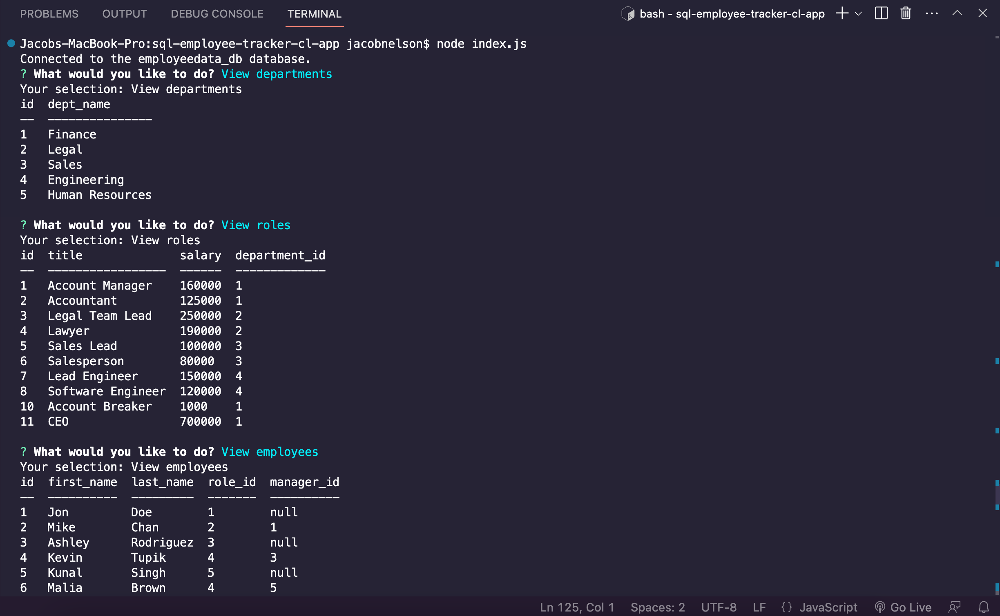

# MySQL Employee Tracker Command Line App

This is a command line application that implements a real SQL database, and interacts with the data using inquirer prompts to navigate around the database to manage it. We are using this command line app to run a CMS application, which can provide a number of tools, including viewing all of a buinesses departments, roles, and employes, as well as adding departments, roles, and employees. You can also update an employees status. This was incredibly helpful in getting to know the behavior of SQL, and working with workbench and SQL Shell in the terminal to seed the data into the database. 

## Links

[Here's a link to the google drive video](https://drive.google.com/file/d/1YVA41iVfPQlL8OygvQoWPPGEZ0Y-NFFV/view)

